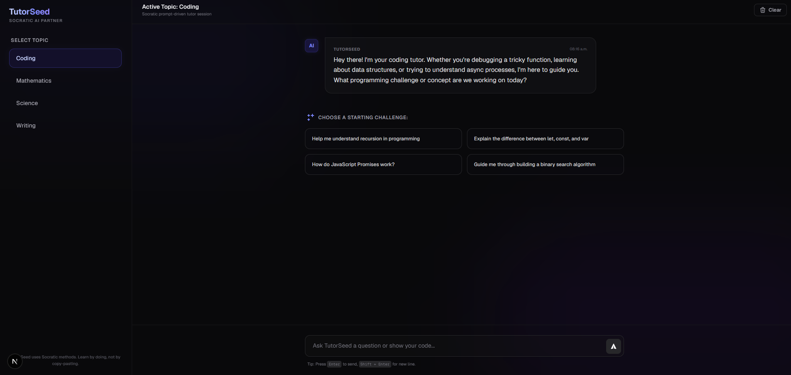
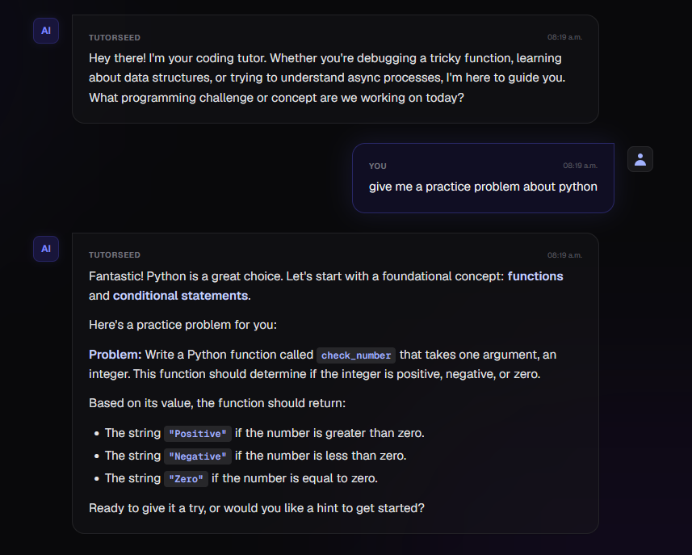

# TutorSeed 
TutorSeed is a modern, premium web-based AI learning partner built using the **Next.js App Router**

Rather than simply giving away solutions, TutorSeed is built on a Socratic tutoring philosophy. It guides students through complex topics step-by-step using interactive prompt templates, constructive guidance, and helpful clues to encourage deep understanding.

# Technologies Used
- React
- Next.js
- TailwindCSS
- Google Generative AI SDK
- React Markdown
- TypeScript
- 
# Features

-   **Socratic Instruction Engine:** The system prompt instructs the AI to never give direct code/answers, focus on single step-by-step instructions, and maintain an encouraging growth mindset.
-   **Multi-Subject Support:** Switch context seamlessly between **Coding**, **Mathematics**, **Science**, and **Writing**.
-   **Suggested Starters:** Engaging starter prompts that match the active subject.
-   **Text Streaming:** Real-time character streaming with responsive loading states and a typing bubble indicator.
-   **Session Management:** Ability to clear/reset chat histories with a prompt confirmation.
-   **Responsive Sidebar:** Designed for both desktop side navigation and dynamic content viewport dimensions.

# Demo

# Contact

If you have any questions, suggestions, or feedback, feel free to reach out to the project maintainer:

    Gieonne Sabijon

Thank you for your interest in this project!
